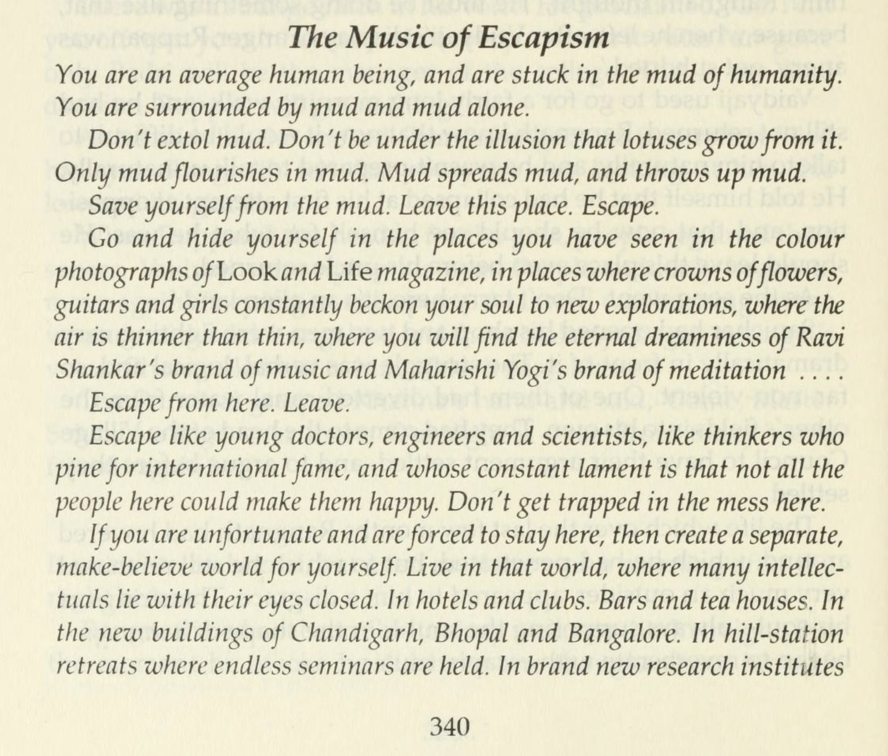

---js
const title = "Raag Darbari and the Collective Indian Subconscious";
const date = "2026-06-14T13:30:00-04:00";
const tags = ["philosophy"];
const draft = false;
---

In this post we discuss how the famous novel by Shrilal Shukla, Raag
Darbari[1][2], correctly pointed out an aspect of the collective Indian
subconscious regarding emigration. This was also pointed out to us, in their own
way, by a very perceptive American businessman.

Raag Darbari is a subversive novel from 1968. It lays bare the soul of
post-independence India, and we believe many of its observations are true even
now. The only English-language novel that we’ve come across that comes close to
its biting satire is Catch-22.

The author[3] was around 22 years old when India got its independence and
later served in the Indian Civil Services, so he had a good idea of how the Indian
psyche interacts with artifacts of the British system. The book is written from
the perspective of a university-educated protagonist, Ranganath, who comes to
his village for vacation and becomes increasingly frustrated by what’s going on
there, and in the end decides to leave.

We have read the book more than once, the first time in 2005, and have realized
over time that many of the thought patterns in the Indian psyche remain the
same now as they were before. We would like to document a couple of excerpts
that the frustrated protagonist notes at the end of the book regarding
emigration. Much of this remains true even now, as far as the actions of
Indians are concerned, but it is covered up with different facades such as
higher education, etc. We first note the excerpts in the original Hindi, and
then present the English translation by Gillian Wright. We would translate the
title of the excerpt as “The Song of Emigration” and would observe that the
translation doesn’t quite capture the causticness of the original Hindi.

[1] https://en.wikipedia.org/wiki/Raag_Darbari_(novel)  
[2] https://archive.org/details/raagdarbarinovel00sukl/page/n9/mode/2up  
[3] https://en.wikipedia.org/wiki/Shrilal_Shukla

