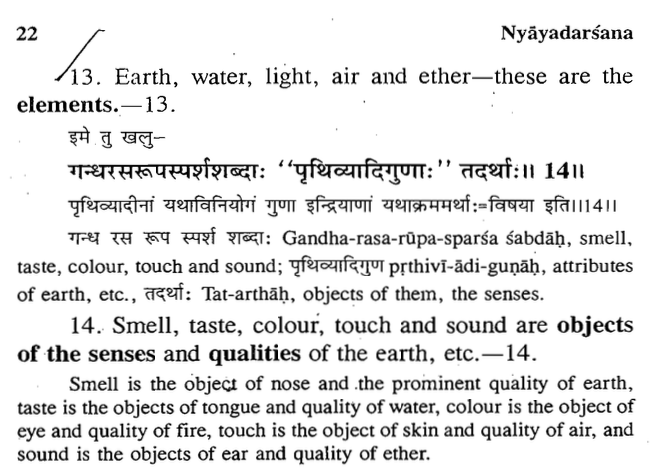

---js
const title = "On Ether";
const date = "2026-08-09T05:30:00-04:00";
const tags = ["philosophy", "NyayaSutra"];
const draft = false;
---

In this post, we hypothesize about how Shruti is heard [1]. We first define *sound*. We define sound as what is heard by the human ear and interpreted by the mind. That is, we don't define it as a pressure wave requiring a physical medium, but define it from the point of view of the human ear.

We argue that sound has two manifestations, the physical and the abstract, and two mediums of travel, the physical and the ether. Characterization of sound as a pressure wave is the common scientific understanding. In this post, we argue that sound could also have an ethereal character if defined from the point of view of the human ear.

First, we note something about the ears. We observe that it is scientifically known that the sense of sound is active even in deep sleep [2]. In a previous post, we proposed an experiment to characterize perceived reality as a cognitive bias [3]; we refer to this state of mind as S. We hypothesize that the mind in S is similar to deep sleep as far as the sense of hearing is concerned, and that the sense of hearing is still intact in S, although the physical manifestation of sound is absent, i.e., we are in a silent place.

We hypothesize that we hear sound when we are in a state of deep concentration, and the mind remembers it when we come out of the state. This can be easily seen in day-to-day life. When someone is deeply concentrating on something like a computer program or a book, and someone says something to them, they hear it but don't react to it immediately, and react to it after they are out of the state of deep concentration, a few seconds or a fraction of a second later.

This is what happens when our mind is meditating in deep concentration: the sense of hearing is intact, and we remember what we were hearing via ether when we come out of the concentration. We believe that this is how Shruti is heard, via ether. We also note that in texts like the Nyaya Sutra, the sense of hearing is connected to ether, not air [4].

Thus, in this post, we argued how Shruti is heard from ether.
 
 

[1] https://en.wikipedia.org/wiki/%C5%9Aruti#Distinction_between_%C5%9Bruti_and_sm%E1%B9%9Bti

[2] https://www.nature.com/articles/s41562-018-0502-5?utm_medium=affiliate&utm_source=commission_junction&utm_campaign=3_nsn6445_deeplink_PID100094349&utm_content=deeplink

[3] https://m-chaturvedi.github.io/blog/040/

[4] https://archive.org/details/nyayasutrasofgautamasatishchandravidyabhushannyayadarsanaofgautamaraghunathgosh_202003_872_G

