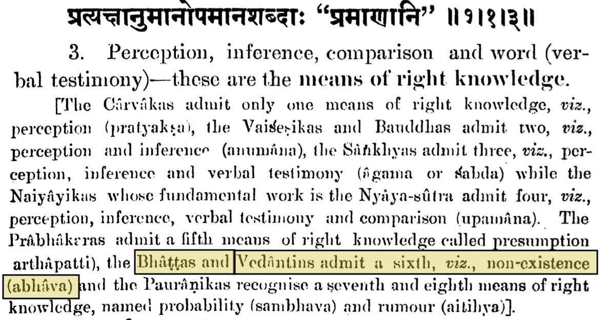

---js
const title = "On Non-Existence as a Means of Knowledge";
const date = "2026-08-22T15:40:00-04:00";
const tags = ["philosophy"];
const draft = false;
---

In this post, we make a note of non-existence[1] (*abhava* in Sanskrit) being a
means of knowledge in the Vedanta school of thought[2] from a commentary on the
Nyaya Sutra[3].

We have extensively written and elaborated on the idea of non-existence being
the origin of things because of how our mind works, i.e., our mind creates an
abstract representation in order to analyze things[4][5]. This can be stated in
another way: the non-existence of something can be a means of knowledge. We
were pleasantly surprised to find this as a means of knowledge in Satish
Chandra's commentary on the Nyaya Sutra[6]:

Thus, in this post, we noted an interesting observation about non-existence
being a source of knowledge from Satish Chandra's commentary on the Nyaya
Sutra.

[1] https://en.wikipedia.org/wiki/Abhava  
[2] https://en.wikipedia.org/wiki/Vedanta  
[3] https://en.wikipedia.org/wiki/Ny%C4%81ya_S%C5%ABtras  
[4] https://m-chaturvedi.github.io/blog/017/  
[5] https://m-chaturvedi.github.io/blog/040/  
[6] https://archive.org/details/TheNyayaSutrasOfGotama/page/2/mode/2up
