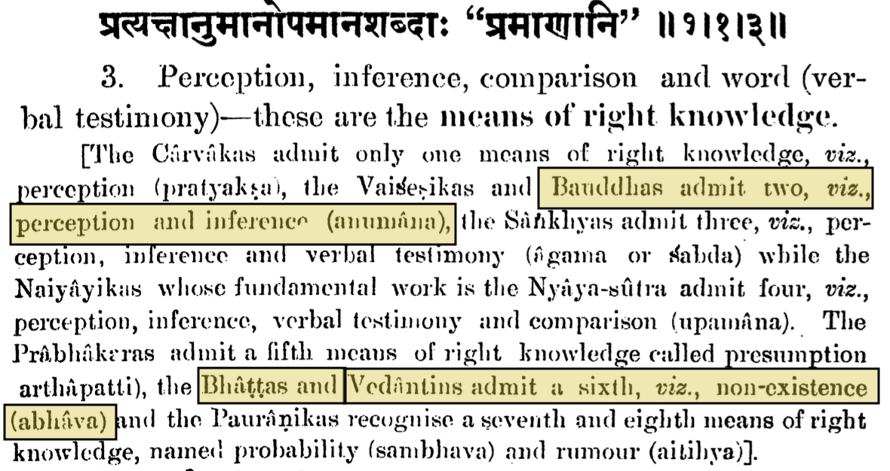

---js
const title = "On Enlightenment and the Two Interpretations of Perceived Reality";
const date = "2026-08-23T12:40:00-04:00";
const tags = ["philosophy"];
const draft = false;
---

In this post, we argue that the two ways of characterizing perceived reality
change the definition of enlightenment.

As we mentioned in a previous post, perceived reality can be characterized as a
cognitive bias when the mind is disconnected from the body and the senses[1],
and perceived reality is to be understood by the mind alone, without the body
and senses.

When perceived reality is not considered a cognitive bias, we end up with an
interpretation of enlightenment that is caused by detachment from material
things. That is, we are born attached, then become detached, and reach
enlightenment. Of note here is that both attachment and detachment assume the
presence of emotions towards the material world. We have previously noted that
this definition leads to Maya being the mother of Buddha[2].

When perceived reality is characterized as a cognitive bias, and we start
analyzing enlightenment only from the point of view of the mind, there cannot
be any emotions assumed, and we get a definition that is based on knowledge and
the lack thereof, i.e., ignorance. So, the definition of enlightenment becomes
a change in the state of the mind from ignorance to knowledge. We observe that
this change is similar to how the definition of sin changes[3]. So, according
to the following definition from Advaita Vedanta[4], the individual is born
enlightened but mistakenly identifies themself with the body and senses:

> In a popular sense, [A]dvaita is often expressed as the famous diction that
> Atman is Brahman, meaning that jivatman, the individual experiencing self, is
> ultimately pure awareness mistakenly identified with body and the senses, and
> non-different ("na aparah") from Ātman/Brahman, the highest Self or Reality;
> the knowledge of this true identity is liberating.

We further guess that this difference is due to the fact that the 'means of
knowledge'[5] (*Pramana*) for Bauddha philosophy and Vedanta philosophy, of which
Advaita Vedanta is a part, are different:

Thus, in this post, we argue that the definition of enlightenment depends on
whether perceived reality is characterized as a cognitive bias or not.

[1] https://m-chaturvedi.github.io/blog/038/  
[2] https://m-chaturvedi.github.io/blog/040/  
[3] https://m-chaturvedi.github.io/blog/061/  
[4] https://en.wikipedia.org/wiki/Advaita_Vedanta#Etymology  
[5] https://en.wikipedia.org/wiki/Pramana
